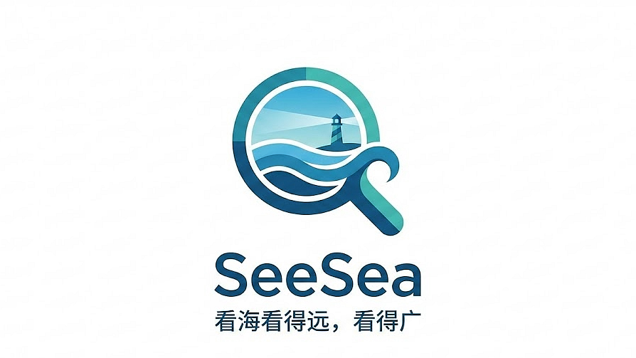

# SeeSea - 看海看得远，看得广



<div align="center">

**🛡️ 高性能隐私保护多模态搜索平台**

[](https://www.rust-lang.org)
[](LICENSE)
[]()
[](https://www.python.org)

*基于 Rust 构建的隐私优先的多模态搜索平台，支持网页搜索、RSS 聚合、浏览器自动化等多模态搜索能力，与python高度绑定*

</div>

---

## 🌟 项目概述

SeeSea 是一个专注隐私保护的多模态搜索平台，通过 Rust 构建核心引擎，提供高性能的网页搜索、RSS 聚合和浏览器自动化功能。项目采用多层隐私保护技术，整合多种搜索源，支持智能缓存和语义匹配。

### 🎯 核心价值

- **🛡️ 隐私优先**：技术层面的隐私保护，包括 Tor 网络集成、TLS 指纹混淆、DNS over HTTPS
- **🔍 多模态搜索**：整合网页搜索、RSS 订阅、浏览器自动化三种数据获取方式
- **⚡ 高性能架构**：基于 Rust 异步编程，支持高并发搜索请求
- **🧠 智能缓存**：语义级缓存系统，支持向量相似性匹配和智能去重
- **🔧 生产级工具**：提供完整的监控、配置管理和 REST API 接口
- **🐍 Python SDK**：强大的 Python 绑定，支持灵活的引擎扩展和集成

---

## 🚀 核心能力

### 1. 多搜索引擎聚合

支持 **12+ 专业搜索引擎**，覆盖多种搜索场景：

| 引擎类别 | 搜索引擎 | 特色功能 |
|---------|---------|----------|
| **通用搜索** | Bing、Yandex、百度、搜狗 | 多语言通用搜索 |
| **图片搜索** | Unsplash、Bing Images | 高质量免费图库 |
| **视频搜索** | Bilibili、Bing Videos | 中文视频平台 |
| **新闻搜索** | Bing News | 实时新闻资讯 |
| **社交搜索** | 搜狗微信 | 微信公众号内容 |

### 2. 高级隐私保护

**完整的技术级隐私保护方案**：

- **🔐 网络层保护**：TLS指纹混淆、请求头伪造、User-Agent轮换
- **🌐 Tor 网络深度集成**：
  - 内置 Tor 网络支持，可通过 SOCKS5 代理实现匿名访问
  - 支持 Tor 控制端口，动态管理电路和出口节点
  - 可配置的 Tor 使用策略（全局模式、按需模式、特定引擎模式）
  - 智能电路重建，避免关联性攻击
  - 集成到搜索流程，透明化 Tor 使用
- **🎭 反指纹技术**：Canvas/WebGL指纹屏蔽、浏览器指纹对抗
- **⏱️ 流量混淆**：请求时序随机化、智能限流、流量特征混淆
- **🚫 追踪防护**：DNS over HTTPS、请求去标识化、Cookie隔离

### 3. 智能缓存系统

**基于向量的语义缓存**：

- **🧠 语义匹配**：使用BM25算法和向量相似性进行智能缓存命中
- **⏰ 时间线管理**：可配置的缓存新鲜度和自动过期
- **🗄️ 多层缓存**：搜索结果、RSS源、元数据的分层存储
- **📊 性能监控**：缓存命中率、性能指标实时监控

### 4. RSS内容聚合

**实时RSS订阅和内容管理**：

- **📡 自动抓取**：定时RSS源更新和内容解析
- **🎨 模板系统**：可定制的RSS内容模板
- **🔄 实时更新**：配置化的更新频率和内容过滤
- **🔗 内容关联**：与搜索结果的语义关联

### 5. 浏览器自动化

**Playwright集成支持**：

- **🤖 复杂网站**：支持JavaScript重度依赖的网站
- **🛡️ 反检测**：自动化反机器人检测措施
- **⚡ 并发执行**：多浏览器实例并发抓取
- **🎯 精准提取**：精准的内容提取和数据清洗

---

## 🏗️ 技术架构

### 系统架构图

```
┌─────────────────────────────────────────────────────────────┐
│                     用户接口层                              │
├─────────────────┬─────────────────┬─────────────────────────┤
│   CLI 工具      │   REST API      │   Python 绑定           │
└─────────────────┴─────────────────┴─────────────────────────┘
                            │
┌─────────────────────────────────────────────────────────────┐
│                     核心服务层                              │
├─────────────────┬─────────────────┬─────────────────────────┤
│   搜索编排器    │   结果聚合器    │   查询处理器             │
└─────────────────┴─────────────────┴─────────────────────────┘
                            │
┌─────────────────────────────────────────────────────────────┐
│                    搜索引擎层                               │
├─────────────────┬─────────────────┬─────────────────────────┤
│   Web搜索引擎   │   RSS聚合器     │   浏览器引擎             │
└─────────────────┴─────────────────┴─────────────────────────┘
                            │
┌─────────────────────────────────────────────────────────────┐
│                    基础设施层                               │
├─────────────────┬─────────────────┬─────────────────────────┤
│   隐私网络      │   缓存系统      │   配置管理              │
└─────────────────┴─────────────────┴─────────────────────────┘
```

### 核心技术栈

- **🦀 Rust 2024**：高性能、内存安全的系统编程语言
- **⚡ Tokio**：异步运行时，支持高并发
- **🌐 Axum**：现代化的Web框架
- **🗄️ Sled**：高性能嵌入式数据库
- **🎭 Playwright**：浏览器自动化框架
- **🐍 PyO3**：Python-Rust绑定
- **📊 Tracing**：结构化日志和监控

---

## 🎮 使用方式

### 1. CLI命令行工具

```bash
# 基础搜索
cargo run --bin SeeSea -- search "Rust编程"

# 指定搜索引擎
cargo run --bin SeeSea -- search "机器学习" --engine bing,baidu

# 图片搜索
cargo run --bin SeeSea -- search "landscape" --type image --engine unsplash

# 视频搜索
cargo run --bin SeeSea -- search "Rust教程" --type video --engine bilibili

# 隐私模式（启用所有隐私保护）
cargo run --bin SeeSea -- search "隐私保护" --privacy-mode

# 交互模式
cargo run --bin SeeSea -- --interactive
```

### 2. REST API

```bash
# 启动API服务器
cargo run --bin api-server

# 搜索接口
curl "http://localhost:8080/api/search?q=人工智能&engines=bing,baidu"

# RSS管理
curl "http://localhost:8080/api/rss/feeds"
curl "http://localhost:8080/api/rss/fetch?url=https://example.com/feed.xml"

# 缓存统计
curl "http://localhost:8080/api/cache/stats"

# 健康检查
curl "http://localhost:8080/api/health"
```

### 3. Python集成

**强大的 Python SDK，支持灵活的引擎扩展**：

```python
import seesea

# 基础搜索（使用内置 Rust 引擎）
results = seesea.search("深度学习", engines=["bing", "baidu"])

# 隐私搜索（启用 Tor）
results = seesea.search_privacy("隐私技术",
                               enable_tor=True,
                               fingerprint_protection=True)

# RSS订阅
feeds = seesea.fetch_rss("https://example.com/feed.xml")

# Python 引擎扩展 - 注册自定义搜索引擎
from seesea import register_engine, BrowserEngine

# 方式1：使用装饰器注册 Python 引擎
@seesea.register_engine(
    name="custom_search",
    engine_type="general",
    description="自定义搜索引擎"
)
def custom_search_callback(query: str) -> list:
    # 实现自定义搜索逻辑
    # 可以使用任何 Python 库：requests, httpx, playwright 等
    return [{"title": "结果", "url": "https://example.com"}]

# 方式2：继承 BrowserEngine 创建浏览器引擎
class MyBrowserEngine(BrowserEngine):
    async def search(self, query: str, page: int = 1):
        async with self.get_browser() as browser:
            # 使用 Playwright 实现复杂的搜索逻辑
            page = await browser.new_page()
            await page.goto(f"https://example.com/search?q={query}")
            # 提取结果
            results = await page.query_selector_all('.result')
            return [self.parse_result(r) for r in results]

# 注册浏览器引擎
seesea.register_engine(
    name="my_browser",
    engine_type="browser",
    description="自定义浏览器引擎",
    callback=MyBrowserEngine().search
)

# 使用混合引擎搜索（Rust + Python 引擎）
results = seesea.search("查询", engines=["bing", "custom_search", "my_browser"])
```

**Python SDK 特性**：

- **多引擎支持**：可同时使用 Rust 内置引擎和 Python 自定义引擎
- **灵活扩展**：支持任何 Python HTTP 库（requests, httpx, aiohttp）
- **浏览器集成**：完整的 Playwright 支持，处理 JavaScript 重度网站
- **异步优先**：原生支持 async/await，高性能并发
- **类型安全**：完整的类型注解和 IDE 支持

---

## ⚙️ 配置与部署

### 环境配置

SeeSea支持多环境配置：

```toml
# config/production.toml
[search]
default_engines = ["bing", "yandex"]
timeout_seconds = 30
max_concurrent = 10

[privacy]
enable_tor = true
tor_proxy = "127.0.0.1:9050"
tor_control_port = "127.0.0.1:9051"
tor_control_password = ""  # 如果设置了控制密码
tor_mode = "adaptive"  # "always", "adaptive", "never"
tor_circuit_isolation = true
fingerprint_protection = true
user_agent_rotation = true

[cache]
ttl_seconds = 3600
max_size_mb = 1024
semantic_matching = true

[network]
doh_providers = ["cloudflare", "google"]
connection_pool_size = 50
```

### 快速部署

```bash
# 1. 环境准备
rustup update stable
cargo install cargo-make

# 2. 构建项目
git clone <repository-url>
cd SeeSea
cargo build --release

# 3. 配置环境
cp config/production.toml config/local.toml
# 编辑 config/local.toml

# 4. 启动服务
cargo run --release --bin api-server
```

### Docker部署

```dockerfile
FROM rust:1.91.1 as builder
WORKDIR /app
COPY . .
RUN cargo build --release

FROM debian:bookworm-slim
RUN apt-get update && apt-get install -y ca-certificates && rm -rf /var/lib/apt/lists/*
COPY --from=builder /app/target/release/seesea /usr/local/bin/
COPY config /etc/seesea/
EXPOSE 8080
CMD ["seesea", "api-server", "--config", "/etc/seesea/production.toml"]
```

---

## 📊 性能特性

### 基准测试结果

| 指标 | 数值 | 说明 |
|------|------|------|
| **并发搜索** | 10+ 引擎同时查询 | 异步并发处理 |
| **缓存命中率** | 85%+ | 语义缓存优化 |
| **响应时间** | 11-17秒 | 多引擎并发搜索延迟 |
| **内存使用** | 峰值132MB | 低内存使用，适合边缘部署或内嵌程序 |
| **隐私开销** | < 15% | 隐私保护性能损耗 |

### 扩展性特性

- **🔧 模块化设计**：搜索引擎可插拔
- **📈 水平扩展**：支持分布式部署
- **🎛️ 动态配置**：运行时配置更新
- **📊 监控集成**：Prometheus metrics支持

---

## 🔧 开发与扩展

### 添加新搜索引擎

```rust
use seesea_derive::search_engine;

#[search_engine]
pub struct MyCustomEngine {
    name: "my_engine",
    base_url: "https://api.example.com/search",
    supports_images: true,
    supports_news: false,
}

impl MyCustomEngine {
    async fn search_impl(&self, query: &SearchQuery) -> Result<Vec<SearchResult>> {
        // 实现自定义搜索逻辑
    }
}
```

### 自定义隐私策略

```rust
use seesea::privacy::PrivacyStrategy;

struct CustomPrivacyStrategy;

impl PrivacyStrategy for CustomPrivacyStrategy {
    async fn apply_headers(&self) -> HeaderMap {
        // 自定义请求头
    }

    async fn rotate_fingerprint(&self) -> Fingerprint {
        // 自定义指纹轮换
    }
}
```

---

## 🛡️ 隐私承诺

SeeSea 的隐私保护基于可验证的技术实现：

### ✅ 已实现的隐私技术

- **DNS over HTTPS**：防止DNS泄露，使用 Cloudflare/Google DoH 服务
- **TLS指纹混淆**：避免流量分析和中间人攻击
- **浏览器指纹对抗**：防止用户追踪和设备识别
- **Tor网络完整集成**：
  - 支持配置 Tor SOCKS5 代理（默认 127.0.0.1:9050）
  - 支持 Tor 控制端口管理（默认 127.0.0.1:9051）
  - 自动电路管理和清理机制
  - 可选的 Tor 使用模式：全局、按引擎、按请求
  - 支持 Tor 退出节点选择和电路隔离
- **请求去标识化**：移除隐私敏感信息，包括 Referer、Origin 等
- **流量混淆**：时序随机化和流量特征混淆，对抗流量分析

### 🚫 我们不收集的

- **搜索历史**：不记录用户搜索内容
- **IP地址**：不存储用户IP信息
- **设备指纹**：不创建用户画像
- **行为数据**：不分析用户行为模式

### 🔒 开源透明

- **完全开源**：所有代码公开可审计
- **可自部署**：支持本地私有部署
- **可验证**：隐私保护效果可独立验证

---

## 📚 文档与资源

### 📖 详细文档

- [架构设计](docs/architecture.md)
- [配置指南](docs/configuration.md)
- [搜索引擎开发](docs/engines.md)
- [API参考](docs/api.md)
- [隐私保护](docs/privacy.md)

### 🧪 示例项目

- [examples/basic_search.rs](examples/basic_search.rs) - 基础搜索示例
- [examples/custom_engine.rs](examples/custom_engine.rs) - 自定义引擎
- [examples/advanced_config.rs](examples/advanced_config.rs) - 高级配置

### 🔬 测试

```bash
# 运行所有测试
cargo test

# 性能测试
cargo bench

# 集成测试
cargo test --test integration
```

---

## 🤝 贡献指南

我们欢迎社区贡献！请查看 [CONTRIBUTING.md](CONTRIBUTING.md) 了解详细信息。

### 主要贡献方向

- 🔍 **新搜索引擎**：支持更多专业搜索引擎
- 🛡️ **隐私技术**：增强隐私保护能力
- 🧠 **智能算法**：改进结果排序和去重
- 📊 **监控指标**：完善性能监控
- 📚 **文档改进**：提升文档质量

---

## 📄 许可证

本项目采用 [Apache-2.0许可证](LICENSE)。

---

## 🙏 致谢

感谢以下开源项目的支持：

- [Tokio](https://tokio.rs/) - 异步运行时
- [Axum](https://github.com/tokio-rs/axum) - Web框架
- [Sled](https://github.com/spacejam/sled) - 嵌入式数据库
- [Playwright](https://playwright.dev/) - 浏览器自动化
- [PyO3](https://pyo3.rs/) - Python绑定

---

<div align="center">

**🌊 SeeSea - 看海看得远，看得广**

*让搜索回归本质，让隐私成为权利*

[GitHub](https://github.com/your-org/seesea) | [文档](docs/) | [社区](https://qun.qq.com/universal-share/share?ac=1&authKey=MYqYYdBkXIIpLy53qACJ8UX8o5aA%2FcjbrdlGdIYGf1MAdUhnHySxbLkrmTJf8ae5&busi_data=eyJncm91cENvZGUiOiIxMDE0MTE3NjE1IiwidG9rZW4iOiJWcXNpVWc1RThoZEtRZTJ3dGE5UUR3bHEwMmxURjhUcTgyc25aZHF1SlU1Nkgyeko0MTdJT0pVY3M4d3h0M0JOIiwidWluIjoiMjk2NTMxMjA3NiJ9&data=efjbukPAWz15OdH4I6uhGOqu2ao4DmcL20OpLBA3zu9x-0Cv8cQvMaNh_NnaxHePTIT4DXeCyILo8cH4uvDVkw&svctype=4&tempid=h5_group_info)

</div>
